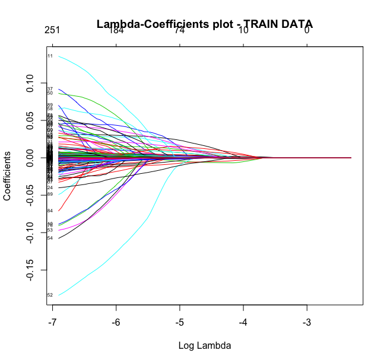
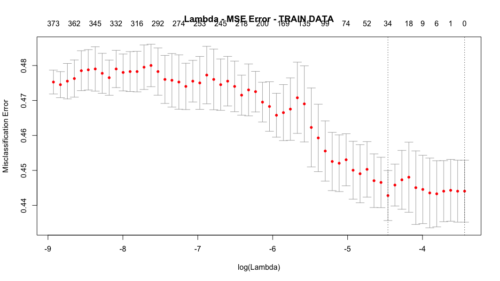

In this example we will try to compare the mean prices of 2012 with 2011 in order to find if the prices went UP or DOWN. In other words we will turn a regression problem into a classification.

* First, we merge the house\_prices\_mean of 2011 & 2012
* Then we compare the values for each and we characterize each area as UP & DOWN and as binary with 1 & 0
* And finally perform our lasso algorithm (using glmnet library), transformed for the needs of our binary problem

The plots of coefficients and cross-validation, produced from the Lasso can be found below:

For train data 75% & test data 25%:

The best model for which yields the lowest error, is a linear model with 32 variables. The estimation accuracy is 56,32%. And the confusion matrix is the following:

|      Lowest accuracy      |  |   Reference  |     |   
|------------|-----------|-----|-----|---|
| |           | **0**   | **1**  |   |
|    **Prediction**         | **0**         | 743 | 575 |   |
|            |**1**       | 2   | 1   |   |
         

However, if we choose the one standard error rule, the number of selected variables is zero (only an intercept) which yields a 56,40% accuracy, a minor change. What is interesting, is its confusion matrix and the model, as it predicts for all areas that they do not belong to category 1. In this case 745 out 1321 test areas are correctly identified. 

|      One stantard error rule       |  |   Reference  |     |   
|------------|-----------|-----|-----|---|
| |           | **0**   | **1**  |   |
|    **Prediction**         | **0**         | 745 | 576 |   |
|            |**1**       | 0   | 0   |   |

