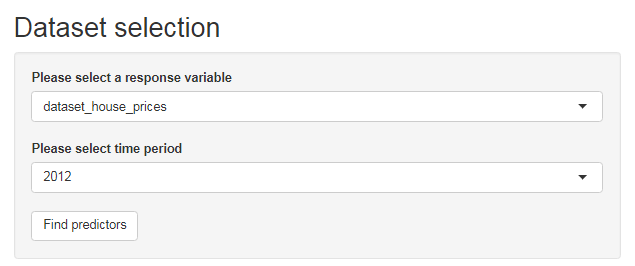
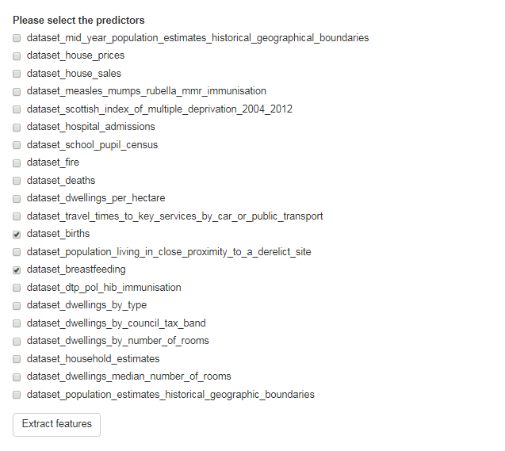
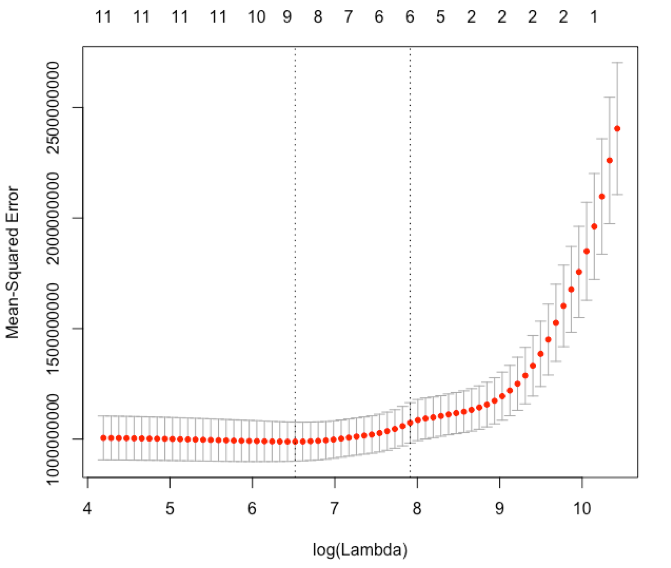

### Machine Learning Component for LSOD

The following module is a part of the H2020 OpenGovIntelligence project.

The Machine Learning Component enables the automatic extraction of numerous features from Linked Open Statistical Data (LSOD) based on the needs of the users and the predictive scenario that is implemented. It also enables the performance of dimension reduction based on the Lasso method in a user friendly approach. The implementation of the Machine Learning Component is based on the JSON-QB API and R server.

The future plans, is to embed supervised machine learning methods for classification and regression problems. The interface will give options for advanced users, who will able to determine the proportion of the train and test data for the fitting methods. In addition they will able to determine different prediction accuracy measures.

## Example on Statistics Portal of Scotland

The user will select the preferred response among a set of different predictors from various datasets. In addition the user will choose based on availability, the preferred time period (specific year, range of years, quartile of a year and more)

In the next step a request will be sent and the interface will return the available features for the selected time period.

Where the user will choose the desired features as predictors. 

Then the lasso algorithm will be executed.
The user will be able to see an MSE-number of variables plot:

And also retrieve the names and the number of predictors based on the "lowest MSE" rule and the "one standard error" rule. 

At the end of this procedure, the user will be able to either download the selected variables, or continue further to other fitting methods

## The calculateFeatures.R script
For the project mentioned above, we have created a script in R which aims to manipulate the different datasets, perform the Lasso method and return the desired variables based on "lowest MSE" & "one standard error" rule. 

The scripts below are those who make the queries with GraphQL in the  Scotland's endpoint (the goal is to not restrict the component only to Scotland).

	source("getCubeObservations.R")
	source("runQuery.R")

These scripts, return single columns with the their assigned areas. So in this case for every query we receive an nx2 table. 

The calculateFeatures.R script aims to combine these different columns and then transform them into a proper  data frame. 

First the response dataframe is retrieved. Based on this, we create a matrix, to store all **reference areas** and then we add all of our variables. The **reference area** column, is the key column which match each observation with every row.

	dataset_full <- df_y[1] 

Having this dataframe, we then add our response (Y).

	dataset_full <-merge(x = dataset_full, y = df_y,  by ="reference.area", all.x = TRUE) 

Then the predictors are added. For this purpose we use a loop. Every predictor is retrieved into a single dataframe, it is transformed from long format into wide (using reshape2), and finally we apply a data cleansing rule: If there are more than 5% missing values for a variable, then automatically is being removed.

	for (i in xDatasets()) {
	#get their dimensions
    q5<- paste('{', i, '{  dimensions { enum_name }}}')
    df5<-runQuery(q5)
    
    #get their measures
    q6<- paste('{', i, '{  measures{ enum_name }}}')
    df6<-runQuery(q6)
    
    df5<-rbind(df5,df6)

    fixedvalues<-c('reference_area:"dz-2001"',year)
    df<-getCubeObservations(i,fixedvalues,tolower(c(t((df5))))) 
    
    #start of matrix transformation
    xnam <- paste( "df$", colnames(df)[c(-1,-ncol(df))] , sep="")
    fmla <- paste(xnam, collapse=" + ")
    ref <- paste ("df$", colnames(df)[1] , sep="")
    measure <- colnames(df)[ncol(df)]
    scen <- as.formula(paste(ref , "~ " , fmla))
    df_formated <- dcast(df ,scen, value.var=measure)
    dataset_name <-sub(".*?data\\.(.*?)\\.observations.*", "\\1", colnames(df)[1])
    colnames(df_formated)[-1] <- paste( dataset_name , "." , colnames(df_formated)[-1] , sep="")
    colnames(df_formated)[1] <- "reference.area"
    
    #data cleansing rule
    dataset_clean <- df_formated[ lapply( df_formated, function(x) sum(is.na(x)) / length(x) ) < 0.05 ]
    dataset_full <-merge(x = dataset_full, y = dataset_clean,  by = "reference.area", all.x = TRUE)

Finally we do some last edits to the final dataset, before we move on the Lasso.

	
    dataset <- dataset_full
    dataset <- dataset[,-1]
    dataset <- data.matrix(dataset)
    dataset <- as.data.frame(dataset)
    dataset <- na.omit(dataset)
    

The Lasso process is automated. The number of folds for Cross Validation is set to 10 by default. In the result we print total number of variables for the "lowest MSE rule" and "one standard error rule"

	
	print(c ("Lowest MSE:" , TestMseWithLambaOfLowTrainMse , "Number of Variables:" , nvarmse  ))
	print(c ("1 Standard Error :" , TestMseWithLambaOfOneStandardErrorTrainMse , "Number of Variables:" , nvarmse  ))
	    