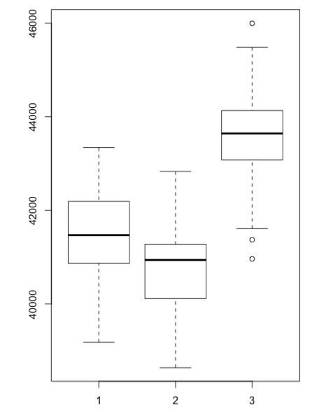

### Predicting House Prices in Scotland using official statistics

## Description of the scenario

The aim of this study is to predict the mean house prices of 2001 data zones in Scotland for 2012. 
Our datasets are retrieved from the official statistics portal of Scotland: http://statistics.gov.scot/ .
Datasets may refer to the current year (2012) or to recent past years (2009-2011).
Numerous features have been retrieved, in an exhaustive way, in order to have an abundance of data to estimate our response (mean house prices of 2012).
Several state-of-the-art machine learning methods have been applied in order to reduce that number of features. 
In our case Lasso seemed to offer the best results.
In addition, we have performed repeated simulations in order to have a robust selection of features, not influenced from different sampling methods. 
Then having our new datasets, including only the most descriptive features, we will move to several fitting methods.

## Methodology
### Step 1: Dataset selection

In this first step, we explored the available datasets, measures, dimensions & granularities which can be found in the statistics portal of Scotland. 

Some examples of dimensions are the: gender, reference period, type of dwelling, type of benefit, age group.

Granularity refers to the levels of depth for each dataset. Some examples are the: country, Council Areas, Electoral Wards, Data Zones. 

Data Zones, which has 6500 observations, is our preferable granularity level.

In addition, in order to better specify the extent of our scenario we had to introduce some specific criteria for our scenario. By introducing these criteria we would be able to:

1.	Avoid any faulty assumptions
2.	Restrict the bounds of our problem; specify the depth of detail and have a clear timespan
3.	Determine the most appropriate measures for our features

**Criterion 1**

Excluding datasets: Council tax bands

During our criteria selection we considered that there may be datasets which are truly correlated with our response, the house sales prices. For this reason, we inferred that the dataset of Council Tax Bands should be excluded from our extraction. 

Council Tax Bands dataset contains data about the number or proportion (in terms of total number of houses) which belong to a specific council tax band for an area. However, these measures are actually derived from the value of houses and for this reason would be unwise use them in our scenarios.

the number of houses according to their value.

**Criterion 2**

2001 data zones (6505 observations) : granularity

We have chosen the most descriptive level which is the 2001 data zones.  

The great number of observations will help to : 
1. Avoid the curse high-dimensionality (have less observation rather than features)
2. Create a more robust model
3. Predict prices for a specific district or neighborhood. 

**Criterion 3**

Year : current and recent past years
Also we would like to determine whether current and past data could add to the prediction of the house prices for 2012. For this reason, we retrieved data for both current (2012) and recent years (2009-2011).

**Criterion 4**

Measure Units:  ratio and exclusion of the count
	
We have chosen as our main measure unit for our datasets the ratio. Ratio is an indicator which returns normalized data. In contrast, count is a measure which can be biased from the different size of an area or other conditions. 

Thus, our data extraction was restricted among these criteria and then all possible data were retrieved, through an exhaustive way.
To achieve this, we focused our exploration in our 2001 data zones - geographic group. Then, we started exploring each dataset to find available data that meet our criteria. Where data were available for different years and measures, all of them were finally extracted. 

### Step 2: Feature extraction

At this step we extract multiple features from every dataset. These features can be later used in the creation of the predictor models.

For instance, let’s have a deeper look in the “Age of First Time Mothers” dataset: If we explore the available dimensions of this dataset we will find out that those are the “reference period” and “age” dimension.

The dimension “age” distinct (or classifies) the measure into three categories: 

1.	mothers under 19
2. mothers over 35 
3. total number of mothers. (there is no ratio measure) 

By this, we will be able to finally extract more than three features; we will extract all the possible combinations with measure type ratio (criterion 4 from step one) for all the available years (criterion 3). Considering all these, we will finally come up with: 

2 (the two first categories) x 1 (measure type ratio) x 4 (reference periods) 
=8 features.

The same procedure has been followed also for the rest datasets.

### Step 3: Feature Selection

In order to reduce the number of features we have used the Lasso (least absolute shrinkage and selection operator), which is a regression analysis method.

Thanks to this method, we have managed to reduce the number of features significantly, actually over 80%. This has proved very helpful, as we have kept only the important features (which add value in our estimations). In addition, a reduced number of features can help us to better interpret our results.

In addition, we have conducted several repeated experiments (n=100) with random sampling in order to determine which of our final datasets are those which can better predict the house sales for each data zone.

Finally we came up with three datasets which namely are:

1. 2012 Ratio features - 2012 House Prices Mean
2. 2009-2011 Ratio features - 2012 House Prices Mean
3. 2009-2012 Ratio features - 2012 House Prices Mean

##Results

### Data Selection

The datasets that have been retrieved are shown below

| Dataset                                                 | Type  |       | Year |      |      |      | Special subsets or notes          | 
|---------------------------------------------------------|-------|-------|------|------|------|------|-----------------------------------| 
|                                                         | Ratio | Count | 2009 | 2010 | 2011 | 2012 |                                   | 
| Ante-Natal Smoking                                      | X     | X     |      | X    | X    | X    | Reference Period 20xx-20(xx+2)    | 
| Age of First Time Mothers                               | X     | X     | X    | X    | X    | X    | Reference Period 20xx-20(xx+2)    | 
| Attendance Allowance                                    |       | X     |      |      |      | X    |                                   | 
| Births                                                  |       | X     |      |      |      | X    |                                   | 
| Breastfeeding                                           | X     | X     | X    | X    | X    | X    |                                   | 
| DTP/Pol/Hib Immunisation                                | X     | X     | X    | X    | X    | X    |                                   | 
| Deaths                                                  |       | X     |      |      |      | X    |                                   | 
| Disability Living Allowance                             | X     |       | X    | X    | X    | X    | Reference Period 20xx-Q1,Q2,Q3,Q4 | 
| Dwellings by Number of Rooms                            | X     |       | X    | X    | X    | X    |                                   | 
| Dwellings per Hectare                                   | X     |       | X    | X    | X    | X    |                                   | 
| Dwellings by Type                                       | X     |       | X    | X    | X    | X    |                                   | 
| Employment & Support Allowance                          | X     | X     | X    | X    | X    | X    | Reference Period 20xx-Q1,Q2,Q3,Q4 | 
| Fire                                                    | X     | X     | X    | X    | X    | X    |                                   | 
| Hospital Admissions                                     | X     | X     | X    | X    | X    | X    |                                   | 
| Household Estimates                                     | X     | X     | X    | X    | X    | X    |                                   | 
| Income & Poverty Modelled Estimates                     | X     |       | X    | X    | X    | X    | Reference Period 20xx/20(xx+1)    | 
| Measles Mumps Rubella (MMR) Immunisation                |       | X     | X    | X    | X    | X    |                                   | 
| Low Birthweight                                         | X     | X     | X    | X    | X    | X    |                                   | 
| Measles Mumps Rubella (MMR) Immunisation                | X     | X     | X    | X    | X    | X    |                                   | 
| Income Support Claimants                                |       |       | X    | X    | X    | X    |                                   | 
| Job Seeker_s Allowance                                  | X     |       | X    | X    | X    | X    |                                   | 
| Incapacity Benefit & Severe Disablement Claimants       | X     | X     | X    | X    | X    | X    | Reference Period 20xx-Q1,Q2,Q3,Q4 | 
| Population living in close proximity to a derelict site | X     |       | X    | X    | X    | X    |                                   | 
| School Attendance Rate                                  |       | X     | X    | X    | X    | X    |                                   | 
| Pension Credits                                         | X     | X     | X    | X    | X    | X    | Reference Period 20xx-Q1,Q2,Q3,Q4 | 
| School Leaver Destinations Initial                      | X     | X     | X    | X    | X    | X    | Reference Period 20xx/20(xx+1)    | 
| School Pupil Census                                     |       | X     |      |      |      | X    |                                   | 
| Travel times to key services by car or public transport |       | X     |      |      |      | X    |                                   | 
| Working Age Claimants of Key Benefits                   | X     |       | X    | X    | X    | X    | Reference Period 20xx-Q1,Q2,Q3,Q4 | 

Please note that the previous table shows our selected datasets based on our criteria; not all the available datasets & features were extracted. 

**Features** 

The list of all extracted features (450 in total) can be found in the appendix file

### Dimension reduction

**With Lasso method (variable seleection and regularisation).**

|                                               | Ratio                                        |                                                   |                                                   | 
|-----------------------------------------------|----------------------------------------------|---------------------------------------------------|---------------------------------------------------| 
| Name of Dataset                               | 2012 Ratio features - 2012 House Prices Mean | 2009-2011 Ratio features - 2012 House Prices Mean | 2009-2012 Ratio features - 2012 House Prices Mean | 
| Number of used Observations (after cleansing) | 5799                                         | 5971                                              | 5421                                              | 
| Number of Predictors                          | 109                                          | 354                                               | 450                                               | 
| Type of Predictors                            | Ratio                                        | Ratio                                             | Ratio                                             | 
| Year of Predictors                            | 2012                                         | 2009-2011                                         | 2009-2012                                         | 
| Type of Response                              | Mean                                         | Mean                                              | Mean                                              | 
| Year of Response                              | 2012                                         | 2012                                              | 2012                                              | 
| Lasso lowest MSE                              | 1.759.653.444                                | 1.688.913.530                                     | 1.556.214.763                                     | 
| With number of selected variables             | 42                                           | 155                                               | 179                                               | 
| Lasso MSE 1SE                                 | 1.908.480.159                                | 1.755.722.722                                     | 1.651.305.609                                     | 
| Square root                                   | 43686.16                                     | 40862.17                                          | 40636.26                                          | 
| With number of selected variables             | 20                                           | 65                                                | 40                                                | 
| Percentage of reduction                       | 82%                                          | 82%                                               | 92%                                               | 

  
  

**100 random sampling repeats 
-	Variation of results for the three final datasets.**

  

| Variation of MSEs (error of every dataset) | Variation of total number of Selected Predictors |
|------|------|
| | |
| 1.	2009-2011 Ratio features - 2012 House Prices Mean | 1.	2009-2011 Ratio features - 2012 House Prices Mean |
| 2.	2009-2012 Ratio features - 2012 House Prices Mean | 2.	2009-2012 Ratio features - 2012 House Prices Mean
| 3. 2012 Ratio features - 2012 House Prices Mean | 3. 2012 Ratio features - 2012 House Prices Mean| 

  

**Having compared our three different datasets, we concluded that "2009-2012 Ratio features - 2012 House Prices Mean" will be that one, which we are going to use in our prediction - fitting methods.**

**The following plot shows, how the error estimation (or equivalently accuracy), fluctuates for different number of features.**
**In our case we choose a number of features until it does not significantly increase our error of estimation**

  

  

So regarding, 2009-2012 Ratio features - 2012 House Prices Mean dataset:
Finally, only a few datasets were selected from statistics.gov.scot.
These were:

* Age.of.First.Time.Mothers
* Ante.Natal.Smoking
* Breastfeeding
* Disability.Living.Allowance
* Dwellings.by.Number.of.Rooms..Number.Of.Rooms
* Employment.and.Support.Allowance
* Hospital.Admissions
* Income.And.Poverty.Modelled.Estimates
* Pension.Credits
* Job.Seekers.Allowance.Claimants

And from these 10 datasets, only 45 features were selected.   
These were: 

1.  "Age.of.First.Time.Mothers..Age...35.And.Over..Reference.Period...2010.11.2012.13..measure.type...Ratio.x"                                                                                                                                  
2.  "Age.of.First.Time.Mothers..Age...35.And.Over..Reference.Period...2009.10.2011.12..measure.type...Ratio"                                                                                                                                                 
3. "Ante.Natal.Smoking..Population.Group...Former.Smoker..Reference.Period...2011.2013..measure.type...Ratio.x"                                                                                                                                             
4. "Ante.Natal.Smoking..Population.Group...Not.Known.If.Smoking..Reference.Period...2011.2013..measure.type...Ratio"                                                                                                                                        
5.  "Breastfeeding..Breastfeeding.Data.Collection.Time...6.To.8.Week.Review..Population.Group...Breastfed..Reference.Period...2011..measure.type...Ratio"                                                                                                    
6.  "Breastfeeding..Breastfeeding.Data.Collection.Time...6.To.8.Week.Review..Population.Group...Breastfed..Reference.Period...2010..measure.type...Ratio"                                                                                                    
7. "Breastfeeding..Breastfeeding.Data.Collection.Time...6.To.8.Week.Review..Population.Group...Breastfed..Reference.Period...2009..measure.type...Ratio"                                                                                                    
8. "Breastfeeding..Breastfeeding.Data.Collection.Time...6.To.8.Week.Review..Population.Group...Exclusively.Breastfed..Reference.Period...2009..measure.type...Ratio"                                                                                        
9. "Breastfeeding..Breastfeeding.Data.Collection.Time...First.Visit..Population.Group...Breastfed..Reference.Period...2010..measure.type...Ratio"                                                                                                           
10. "Breastfeeding..Breastfeeding.Data.Collection.Time...First.Visit..Population.Group...Breastfed..Reference.Period...2011..measure.type...Ratio"                                                                                                           
11. "DTP.Pol.Hib.Immunisation..Indicator..DTP.Pol.Hib.uptake....Percentage.Vaccinated.Against.DTP.Pol.Hib.By.24.Months..Reference.Period...2010..measure.type...Ratio"                                                                                       
12.  "Dwellings.per.Hectare..Reference.Period...2009..measure.type...Ratio"                                                                                                                                                                                   
13. "Employment.and.Support.Allowance..Age...All..Benefit.Claimed...Employment.Support.Allowance..Ethnicity...All..Gender...All..Reference.Period...2010.Q1..measure.type...Ratio"                                                                           
14. "Hospital.Admissions..Admission.Type...Cancer..Age...All..Gender...All..Reference.Period...2011..measure.type...Ratio"                                                                                                                                   
15. "Hospital.Admissions..Admission.Type...Cerebrovascular.Disease..CVD...Age...All..Gender...All..Reference.Period...2011..measure.type...Ratio"                                                                                                            
16. "Hospital.Admissions..Admission.Type...Accidents..Age...All..Gender...Female..Reference.Period...2009..measure.type...Ratio"                                                                                                                             
17. "Hospital.Admissions..Admission.Type...Disease.Of.The.Digestive.System..DDS...Age...All..Gender...Female..Reference.Period...2009..measure.type...Ratio"                                                                                                 
18. "Hospital.Admissions..Admission.Type...Accidents..Age...All..Gender...Female..Reference.Period...2010..measure.type...Ratio"                                                                                                                             
19. "Hospital.Admissions..Admission.Type...Accidents..Age...All..Gender...Female..Reference.Period...2011..measure.type...Ratio"                                                                                                                             
20. "Hospital.Admissions..Admission.Type...Cancer..Age...All..Gender...Male..Reference.Period...2011..measure.type...Ratio"                                                                                                                                  
21. "Household.Estimates..Indicator..dwellings....Which.Are.Vacant..Reference.Period...2011..measure.type...Ratio"                                                                                                                                           
22. "Household.Estimates..Indicator..dwellings....With..Occupied.Exemptions...Reference.Period...2011..measure.type...Ratio"                                                                                                                                 
23. "Income.And.Poverty.Modelled.Estimates..Indicator..income.and.poverty.modelled.estimates....Estimated.Percentage.Of.Households.With.A.First.Benefit.Unit..Fbu..Income.Of.Less.Than.800Gbp.Per.Week..Reference.Period...2008.2009..measure.type...Ratio"  
24. "Income.And.Poverty.Modelled.Estimates..Indicator..income.and.poverty.modelled.estimates....Estimated.Percentage.Of.Households.With.Low.Income..Less.Than.70..Median..And.Materially.Deprived..Reference.Period...2008.2009..measure.type...Ratio"       
25. "Income.And.Poverty.Modelled.Estimates..Indicator..income.and.poverty.modelled.estimates....Estimated.Percentage.Of.Older.Households.On.Low.Income..Less.Than.60..Median..Before.Housing.Costs..Bhc...Reference.Period...2008.2009..measure.type...Ratio"
26. "Job.Seeker.s.Allowance.Claimants..Age...16.24..Gender...All..Reference.Period...2011.Q1..measure.type...Ratio"                                                                                                                                          
27. "Job.Seeker.s.Allowance.Claimants..Age...16.24..Gender...All..Reference.Period...2011.Q2..measure.type...Ratio"                                                                                                                                          
28. "Job.Seeker.s.Allowance.Claimants..Age...16.24..Gender...All..Reference.Period...2011.Q3..measure.type...Ratio"                                                                                                                                          
29. "School.Leaver.Destinations.Initial..Gender...All..Population.Group...All..Reference.Period...2009.2010..School.Leaver.Destination...Further.Education..measure.type...Ratio"                                                                            
30. "School.Leaver.Destinations.Initial..Gender...Male..Population.Group...All..Reference.Period...2009.2010..School.Leaver.Destination...Higher.Education..measure.type...Ratio"                                                                            
31. "Ante.Natal.Smoking..Population.Group...Former.Smoker..Reference.Period...2011.2013..measure.type...Ratio.y"                                                                                                                                            
32.  "Breastfeeding..Breastfeeding.Data.Collection.Time...6.To.8.Week.Review..Population.Group...Breastfed..Reference.Period...2012..measure.type...Ratio"                                                                                                    
33. "Breastfeeding..Breastfeeding.Data.Collection.Time...First.Visit..Population.Group...Breastfed..Reference.Period...2012..measure.type...Ratio"                                                                                                           
34. "Dwellings.by.Number.of.Rooms..Number.Of.Rooms...6..Reference.Period...2012..measure.type...Ratio"                                                                                                                                                       
35. "Dwellings.by.Number.of.Rooms..Number.Of.Rooms...7..Reference.Period...2012..measure.type...Ratio"                                                                                                                                                       
36. "Dwellings.by.Number.of.Rooms..Number.Of.Rooms...8..Reference.Period...2012..measure.type...Ratio"                                                                                                                                                      
37.  "Dwellings.by.Number.of.Rooms..Number.Of.Rooms...9..Reference.Period...2012..measure.type...Ratio"                                                                                                                                                       
38. "Dwellings.by.Number.of.Rooms..Number.Of.Rooms...10...Reference.Period...2012..measure.type...Ratio"                                                                                                                                                     
39. "Hospital.Admissions..Admission.Type...Disease.Of.The.Digestive.System..DDS...Age...All..Gender...All..Reference.Period...2012..measure.type...Ratio"                                                                                                    
40. "Hospital.Admissions..Admission.Type...Accidents..Age...All..Gender...Female..Reference.Period...2012..measure.type...Ratio"                                                                                                                             
41. "Job.Seeker.s.Allowance.Claimants..Age...16.64..Gender...All..Reference.Period...2012.Q1..measure.type...Ratio"                                                                                                                                          
42. "Job.Seeker.s.Allowance.Claimants..Age...50.64..Gender...All..Reference.Period...2012.Q1..measure.type...Ratio"                                                                                                                                          
43.  "Job.Seeker.s.Allowance.Claimants..Age...16.24..Gender...All..Reference.Period...2012.Q3..measure.type...Ratio"                                                                                                                                          
44.  "Job.Seeker.s.Allowance.Claimants..Age...16.64..Gender...All..Reference.Period...2012.Q3..measure.type...Ratio"                                                                                                                                          
45.  "Job.Seeker.s.Allowance.Claimants..Age...50.64..Gender...All..Reference.Period...2012.Q3..measure.type...Ratio"  

 

