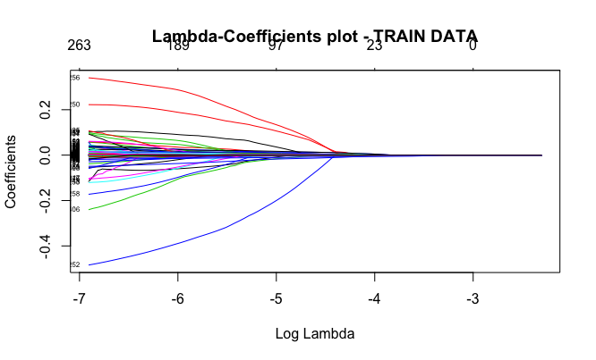
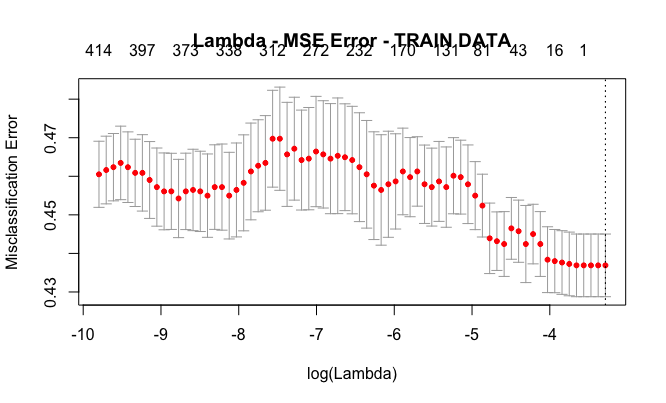

For this case we will try to transform our main regression problem (predict the house\_prices\_mean 2012) into a classification problem.

With these kind of data there are two possible classification problems:

* Either create a classification problem which determines whether an area (observation) exceeds a threshold (e.g. areas that have mean price > 180.000 GBP)
* OR compare the mean prices of 2012 with 2011 in order to find if the prices went UP or DOWN.

In our example we will try to determine the second scenario.    

* First, we merge the house\_prices\_mean of 2011 & 2012
* Then we compare the values for each and we characterize each area as UP & DOWN and as binary with 1 & 0
* And finally perform our lasso algorithm (using glmnet library), transformed for the needs of our binary problem

The plots of coefficients and cross-validation, produced from the Lasso can be found below:

What is interesting, are the confidence intervals of cross-validation, where the misclassification error, could range ±0,01% in almost every number of variables.

